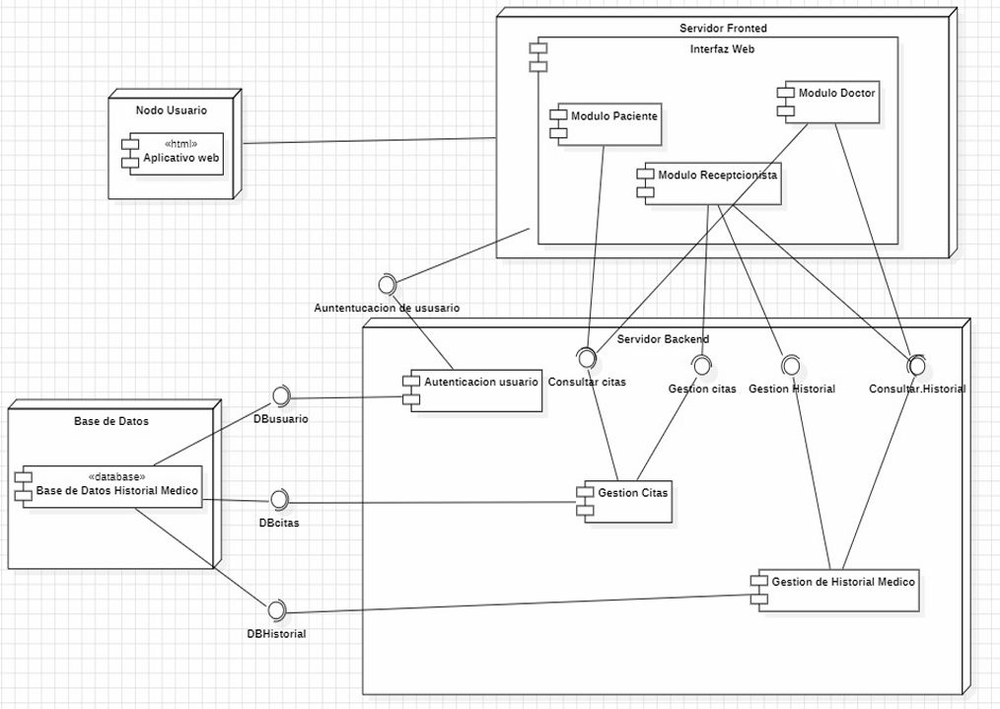

# Arquitectura y Diseño de Software: Sistema de Gestión Odontológica

Diseño estructural, especificación de requerimientos y estimación paramétrica para la plataforma de gestión del Centro Odontológico Luant. Este proyecto abarca exclusivamente la fase de ingeniería de software, aplicando metodologías formales para garantizar la escalabilidad y viabilidad del sistema antes de su codificación.

## Metodologías y Estándares
*   **Arquitectura de Software:** Modelo de 4+1 Vistas de Kruchten.
*   **Modelado y Diseño:** UML Avanzado (Diagramas de Clases, Secuencia, Estados, Componentes y Despliegue).
*   **Estimación de Proyectos:** Método de Puntos de Caso de Uso (UCP).
*   **Gestión de Riesgos:** Matriz de probabilidad e impacto para control preventivo.

## Fases del Diseño de Sistemas

### 1. Arquitectura 4+1 Vistas
El sistema fue estructurado bajo un enfoque formal para satisfacer a todos los *stakeholders* técnicos y funcionales:
*   **Vista Lógica:** Diseño del modelo de dominio y diagramas de clases divididos en paquetes (Usuarios, Citas, Historial Médico, Tratamientos y Facturación).
*   **Vista de Procesos:** Diagramas de estado y secuencia que definen el comportamiento dinámico y la concurrencia del sistema.
*   **Vista de Despliegue:** Topología física cliente-servidor (Frontend, Backend REST API y Base de Datos Relacional).
*   **Vista de Implementación:** Organización del código en tres capas (Presentación, Negocio y Persistencia).
*   **Vista de Casos de Uso:** Especificación detallada de la interacción entre los actores (Recepcionista, Especialista, Paciente).

### 2. Estimación de Esfuerzo y Costos (UCP)
Se realizó una estimación matemática del esfuerzo de desarrollo aplicando Puntos de Caso de Uso:
*   Cálculo de Puntos de Casos de Uso sin Ajustar (UUCP), Factor de Complejidad Técnica (TCF) y Factor de Complejidad Ambiental (ECF).
*   El análisis proyectó un total de 1,947.5 horas-hombre para el ciclo de vida completo (Análisis, Diseño, Programación, Pruebas).
*   Estimación de viabilidad financiera y cálculo de plazos de entrega para equipos de alto rendimiento.

## Documentación Técnica
El repositorio contiene todos los artefactos de ingeniería de software generados durante la fase de diseño:
*   [Ver Informe Final de Diseño y Arquitectura (PDF)](Informe%20Final%20-%20Proyecto%20DSI.pdf)
*   [Ver Presentación Ejecutiva y Cálculos UCP (PDF)](GRUPO%202%20_%20PRESENCTACIÓN%20DSI.pdf)
